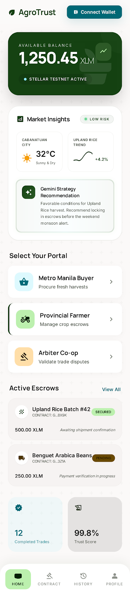
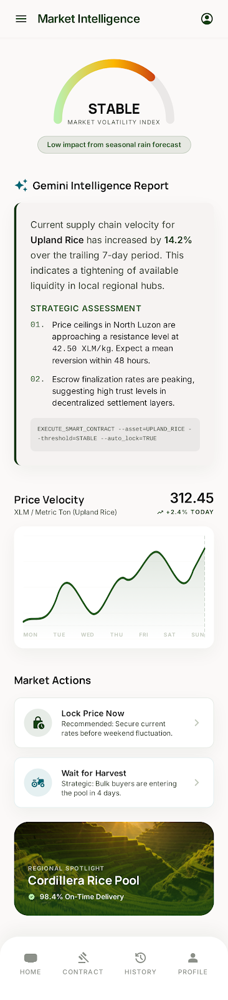
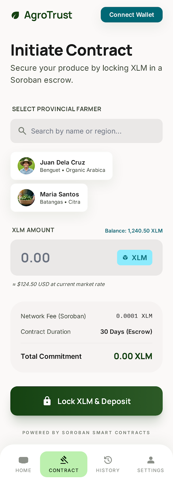
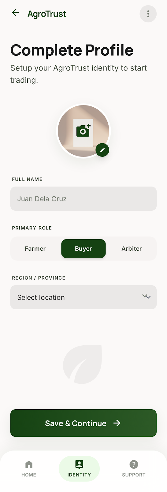
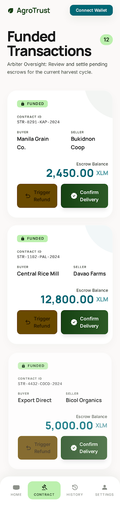
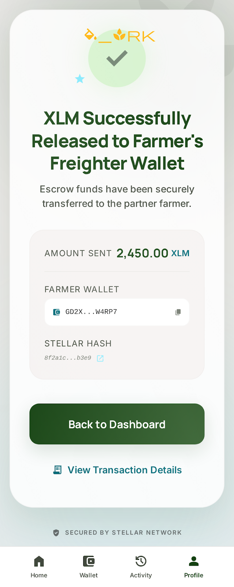
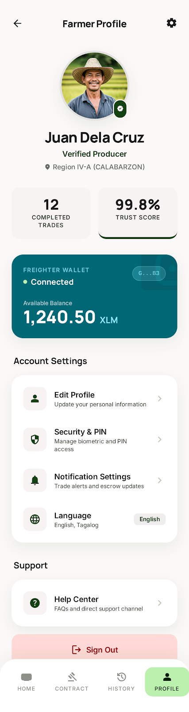
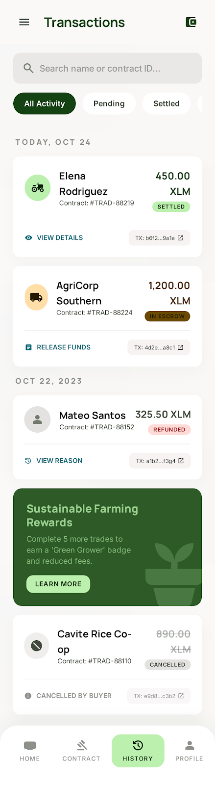
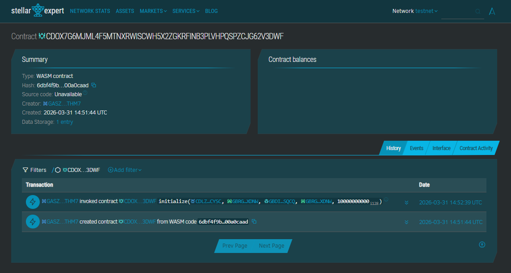

# AgroTrust 🌾

AgroTrust is an **AI-powered**, mobile-first, Soroban-powered Smart Escrow dApp built on the Stellar network. Specifically designed for accessibility in the field, it secures agricultural trade between Filipino Farmers (Sellers) and Buyers (Agro-enterprises) by ensuring funds are only released once delivery is confirmed, or refunded if terms aren’t met.

Instead of relying on fragile "trust-based" manual payments or opaque bank transfers, AgroTrust provides a portable, transparent solution that records escrow states, fund locking, and fulfillment triggers on-chain. This allows farmers to verify proof-of-funds directly from their mobile devices before ever releasing their harvest, ensuring 100% financial transparency even in remote regions.

---

## UI Screenshots

### Dashboard Overview


### 🧠 Gemini AI Market Intelligence


### ✍️ Initiate Contract


### ✍️ Complete Registration


### 📊 Settlement Dashboard


### Success Confirmation


### User Profile


### Transaction History


---

## Stellar Expert Link

[View Contract on Stellar Expert](https://stellar.expert/explorer/testnet/contract/CDOX7G6MJML4F5MTNXRWISCWH5X2ZGKRFINB3PLVHPQSPZCJG62V3DWF)



## Smart Contract Address

`CDOX7G6MJML4F5MTNXRWISCWH5X2ZGKRFINB3PLVHPQSPZCJG62V3DWF`

## Smart Contract Short Description
This Soroban smart contract acts as a decentralized escrow agent for agricultural transactions. It locks buyer funds in a secure program-controlled account and enforces a workflow where funds are only released upon confirmation of delivery by the buyer, or refunded if the transaction is cancelled by authorized parties.

---

## 💡 What The Project Solves

Agricultural communities and trading partners often face high risks in payment settlement:

- **Payment Delays**: Farmers ship produce but wait weeks for bank transfers or cash payments.
- **Counterparty Risk**: Buyers may pay upfront only for the produce to never arrive or be of poor quality.
- **Opaque Tracking**: Groups often rely on private spreadsheets or chat screenshots to track who has paid and what is owed.
- **Trust Requirement**: All members have to trust that the totals and balances managed by a human organizer are correct.

**AgroTrust** improves this by giving the trade relationship a smart-contract-backed source of truth on the Stellar network.

---

## 🧠 AI-Powered Market Intelligence

AgroTrust integrates **Gemini 2.5 Flash** to provide farmers and buyers with real-time, context-aware agricultural strategy.

- **Live Weather Integration**: The AI Advisor pulls real-time environmental data (Temperature, Wind, Conditions) from the **Open-Meteo API** to predict crop health and harvest timing.
- **Dynamic Risk Assessment**: Gemini analyzes market velocity and local weather to recommend when to lock in escrow prices versus waiting for harvest peaks.
- **Parametric Logic**: Provides pseudo-code parameters for smart contract execution based on live environmental triggers (e.g., automated insurance claims if a temperature threshold is hit).
- **Digital Atheneum UI**: A clean, scholarly interface that delivers complex market data in a readable, professional "JSON-structured" format (no markdown artifacts).

---

## ⚙️ How AgroTrust Works

AgroTrust is built around 2 core concepts:

### 1. Escrow Contracts
Each escrow instance has:
- **A Buyer**: The wallet responsible for funding the trade.
- **A Seller (Farmer)**: The wallet that will receive the funds upon successful delivery.
- **The Locked Amount**: The agreed-upon XLM value held by the contract.

### 2. Status States
Each trade follows a strict state-machine tracked on-chain:
- **Funded**: Money is moved from the Buyer to the contract vault.
- **Completed**: Funds are released to the Farmer.
- **Refunded**: Funds are returned to the Buyer.

The wallet that initializes the contract defines these roles and the amount.

## 🛡️ Core Rules Enforced By The Contract

The smart contract guarantees the following security measures on-chain:

- **Specified Funding**: Only the designated Buyer can deposit the funds required for the escrow.
- **Authorized Release**: Only the Buyer can trigger the `confirm_delivery` function to release funds to the Farmer.
- **Safe Refunds**: Only the Buyer (or an appointed Arbiter) can trigger the `refund` function.
- **Balance Privacy**: While all transactions are public, each escrow instance tracks its balance independently, ensuring funds for one farmer are never mixed with another.

This means AgroTrust supports multiple simultaneous trades across different farmers and buyers without mixing permissions or balances.

## 📋 Example User Flow

1. **Trade Initiation**: Paul (Buyer) creates an escrow contract for 5,000 XLM with Rice Farmer Juan.
2. **On-Chain Funding**: Paul deposits the 5,000 XLM into the contract. Juan can now see that the funds are "Locked" and guaranteed.
3. **Logistics**: Juan ships the sacks of rice to Paul's distribution center.
4. **Verification**: Paul inspects the shipment and finds it meets quality standards.
5. **Settlement**: Paul clicks "Confirm Delivery" on the AgroTrust dashboard.
6. **Payment Release**: The contract instantly moves the 5,000 XLM to Juan's wallet.
7. **Verification**: Anyone with the Contract ID can inspect the state on-chain via Stellar Expert.

---

## 🏗️ Project Architecture

This repository is a structured monorepo consisting of:

- **Soroban Smart Contract**: Located in [`src/lib.rs`](src/lib.rs). Written in Rust with `soroban-sdk`.
- **Vite & React Frontend**: Located in [`frontend/`](frontend/). Integrates with the Stellar network.

### Smart Contract
The contract manages:
- Current Escrow state.
- Authorization checks for Buyer/Seller roles.
- Direct XLM transfers via the Stellar Asset Contract.

**Primary contract methods:**
- `initialize`: Setup the Buyer, Seller, Arbiter, and Amount.
- `deposit`: Fund the escrow from the Buyer's wallet.
- `confirm_delivery`: Release funds to the Seller.
- `refund`: Return funds to the Buyer.
- `get_state`: Return the current workflow status.

Tests live in [`src/test.rs`](src/test.rs).

### Frontend
A high-fidelity dashboard that integrates with:
- `@stellar/stellar-sdk` & `@stellar/freighter-api`
- Freighter browser wallet.
- Soroban RPC nodes on Stellar Testnet.

The UI allows users to:
- Connect their Stellar wallet.
- Initiate and track agricultural contracts.
- View real-time XLM balances and transaction history.
- Confirm delivery or request refunds via Freighter.

---

## 💻 CLI Examples

**Initialize an Escrow:**
```bash
stellar contract invoke \
  --id <CONTRACT_ID> \
  --source-account <ADMIN> \
  --network testnet \
  -- initialize \
  --token <XLM_CONTRACT_ID> \
  --buyer <BUYER_ADDRESS> \
  --seller <FARMER_ADDRESS> \
  --arbiter <BUYER_ADDRESS> \
  --amount 10000000000
```

**Deposit/Fund (Buyer):**
```bash
stellar contract invoke \
  --id <CONTRACT_ID> \
  --source-account <BUYER_ADDRESS> \
  --network testnet \
  -- deposit \
  --from <BUYER_ADDRESS>
```

**Check Escrow State:**
```bash
stellar contract invoke \
  --id <CONTRACT_ID> \
  --source anyone \
  --network testnet \
  -- get_state
```

**Confirm Delivery (Buyer):**
```bash
stellar contract invoke \
  --id <CONTRACT_ID> \
  --source-account <BUYER_ADDRESS> \
  --network testnet \
  -- confirm_delivery \
  --buyer <BUYER_ADDRESS>
```

---

## 🗄️ Storage Layout

AgroTrust utilizes **Soroban Instance Storage** to persist the escrow state and participant data. By using instance storage, the data is directly tied to the contract's lifecycle and is highly efficient for frequent read/writes during the trade workflow.

### Data Keys (`DataKey` Enum)
The following keys are stored in the contract's instance storage:

| Key | Description | Data Type |
| :--- | :--- | :--- |
| `Token` | The Native XLM Stellar Asset Contract address. | `Address` |
| `Buyer` | The wallet authorized to fund the escrow. | `Address` |
| `Seller` | The farmer's wallet that receives the funds. | `Address` |
| `Arbiter` | The trusted party (e.g., Buyer/Co-op) that triggers release/refund. | `Address` |
| `Amount` | The exact quantity of XLM (in stroops) to be locked. | `i128` |
| `State` | The current workflow phase (`Funded`, `Completed`, etc.). | `EscrowState` |

---

## 🧪 Detailed Test Coverage

The AgroTrust contract is backed by a comprehensive suite of Rust unit tests in `src/test.rs` to ensure the safety of agricultural funds. The tests cover 100% of the core state transitions and authorization rules.

### Core Test Suites:

1. **Initialization Logic**
   - ✅ `test_initialize_success`: Verifies correct setup and state transition to `AwaitingDeposit`.
   - ✅ `test_initialize_already_initialized`: Guards against re-initialization of an existing contract.
   - ✅ `test_initialize_invalid_amount`: Prevents creating contracts with zero or negative XLM.

2. **Deposit & Funding**
   - ✅ `test_deposit_success`: Confirms XLM is moved from Buyer to Contract and state updates to `Funded`.
   - ✅ `test_deposit_not_initialized`: Rejects deposits on unconfigured contracts.
   - ✅ `test_deposit_invalid_state`: Blocks duplicate deposits or deposits after completion.

3. **Settlement & Fulfillment**
   - ✅ `test_confirm_delivery_success`: Ensures funds move safely to the Seller and state completes.
   - ✅ `test_confirm_delivery_not_funded`: Blocks release if funds haven't been locked yet.

4. **Refund Security**
   - ✅ `test_refund_success`: Confirms Buyer receives funds back if the trade is cancelled.
   - ✅ `test_refund_not_funded`: Blocks refunds if the contract was never funded.

---

## 🚀 Project Setup Guide (Local Development)

Follow these steps to run AgroTrust on your machine.

### 1. Prerequisites
- **Rust & Cargo** (`rustup`)
-- **Stellar CLI** (v22+)
-- **Node.js** (v18+)
-- **Freighter Extension** (Set to Testnet)

### 2. Installation
```bash
# Clone the repository
git clone https://github.com/polsalarm/AgroTrust.git
cd AgroTrust

# Install frontend dependencies
cd frontend
npm install
```

### 3. Smart Contract Build & Test
```bash
# From the root directory
cargo test
stellar contract build
```
*Expected WASM output:* `target/wasm32-unknown-unknown/release/agrotrust_escrow.wasm`

### 4. Configuration
Create a `.env` file in the `frontend/` directory:
```env
VITE_CONTRACT_ID=CDOX7G6MJML4F5MTNXRWISCWH5X2ZGKRFINB3PLVHPQSPZCJG62V3DWF
VITE_RPC_URL=https://soroban-testnet.stellar.org
VITE_NETWORK_PASSPHRASE="Test SDF Network ; September 2015"
VITE_NATIVE_XLM_TOKEN_ID=CDLZFC3SYJYDZT7K67VZ75HPJVIEUVNIXF47ZG2FB2RMQQVU2HHGCYSC
VITE_HORIZON_URL=https://horizon-testnet.stellar.org
```

### 5. Run Local Server
```bash
cd frontend
npm run dev
```

---

## 🛠️ Contract API Reference

### `initialize(token, buyer, seller, arbiter, amount)`
Sets up the escrow terms. Can only be called once per contract instance.

### `deposit(from)`
Locks the specified amount from the buyer's wallet into the contract.

### `confirm_delivery(buyer)`
Releases the locked funds directly to the farmer's wallet.

### `refund(buyer)`
Returns the locked funds back to the buyer's wallet.

### `get_state() -> EscrowState`
Returns the current state of the escrow (Funded, Completed, or Refunded).

---

## 🏗️ Technology Stack
- **Smart Contract**: Rust, Soroban SDK
- **AI Advisor**: Gemini 2.5 Flash (Google Generative AI SDK)
- **Environmental Data**: Open-Meteo API (Real-time weather)
- **Frontend**: Vite, React, Tailwind CSS
- **Blockchain**: Stellar Testnet, Freighter API
- **Tooling**: Stellar CLI, Cargo

## 📂 Repo Structure

```text
.
├── src/                    # Soroban Smart Contract (Rust)
│   ├── lib.rs              # Core Escrow logic and state machine
│   └── test.rs             # 100% Rust unit test coverage
├── frontend/               # AI-Powered React Application
│   ├── src/                # Frontend Source
│   │   ├── services/       # Gemini 2.5 Flash & Weather integration
│   │   ├── pages/          # High-fidelity Dashboard & Market Insights
│   │   ├── hooks/          # Custom Stellar/Wallet hooks
│   │   └── context/        # Global state management
│   ├── images/             # UI Screenshots (Intelligence, Settlement, etc.)
│   └── .env                # (Ignored) Gemini & Stellar configuration
├── target/                 # (Ignored) Compiled WASM artifacts
├── Cargo.toml              # Rust contract dependencies
└── README.md               # Project documentation
```

## 🎯 Current Status
- ✅ Working Soroban Escrow Contract
- ✅ **Live AI Intelligence Advisor (Gemini 2.5 Flash)**
- ✅ **Real-time Weather Context Integration**
- ✅ Manual Terminal Initialization (Testnet)
- ✅ Integrated Freighter Wallet Signing
- ✅ Pixel-perfect Agricultural Dashboard
- ✅ Smart Account Auto-Registration
- ✅ Real-time Balance & State Tracking
- ✅ Testnet-oriented configuration
- ✅ Rust tests for core contract rules

---

## 🚀 Future Scope & Possible Adjustments
AgroTrust is designed to evolve into a full-scale agricultural supply chain platform. Planned enhancements include:

- **Multi-Crop Support**: Expand escrow logic to handle tiered deliveries and partial fulfillments.
- **Automated Dispute Resolution**: Integrate third-party arbiters for quality-check verification before fund release.
- **Dynamic Pricing**: Link contract amounts to real-time market data APIs for fair agricultural trade.
- **On-chain History**: implement comprehensive event logging for a fully searchable trade ledger.
- **Mobile Integration**: optimize the dashboard for field use by farmers in rural areas.
- **Analytics Dashboard**: add visual insights for trade health, seasonal trends, and payment efficiency.

---
Created with ❤️ by Paul Dacalan
